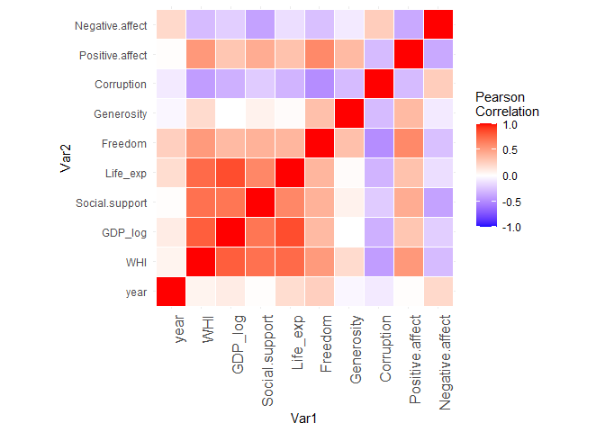
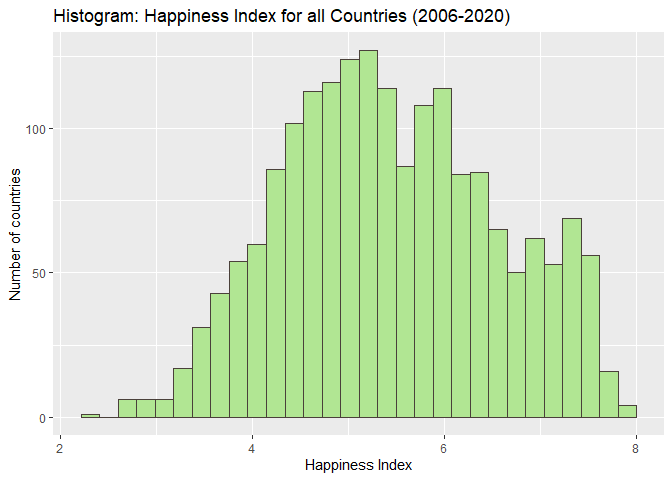
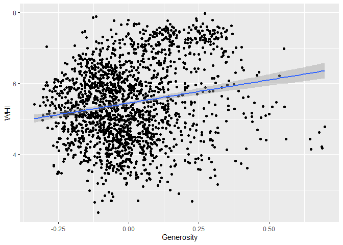
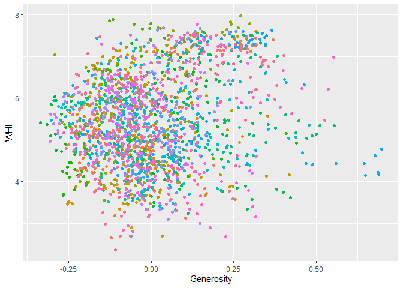
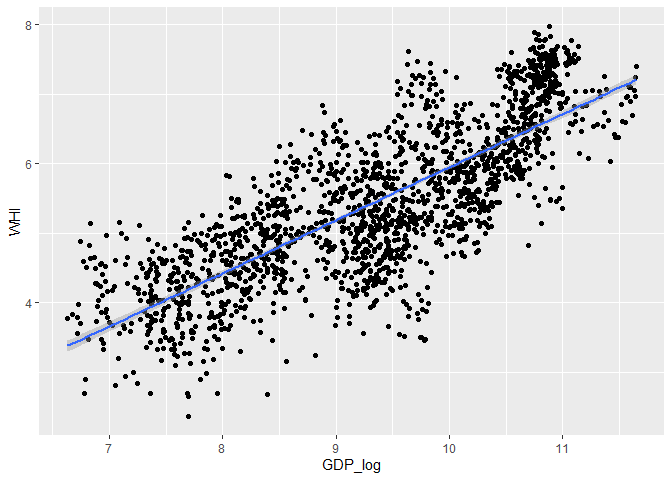
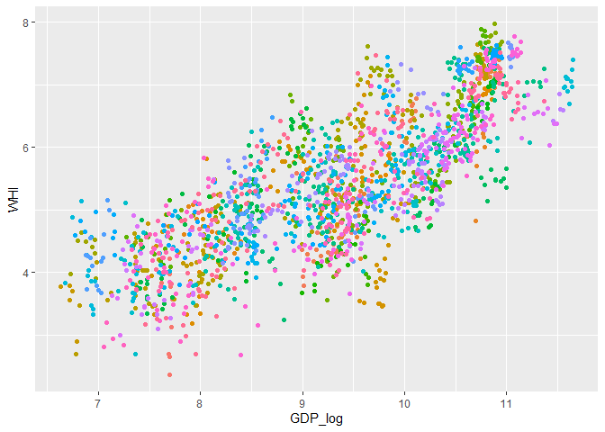
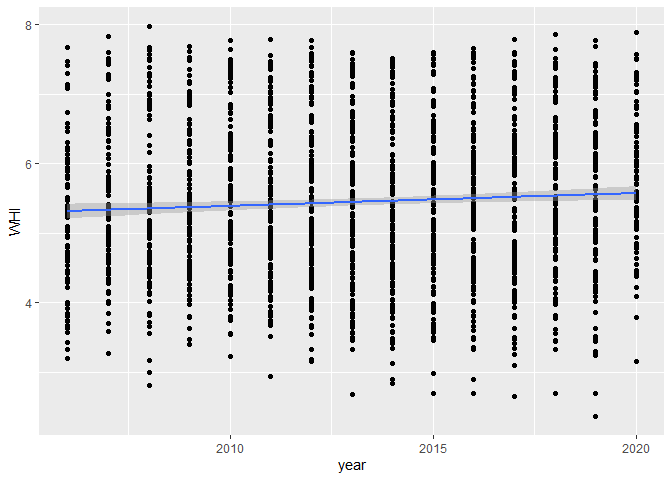
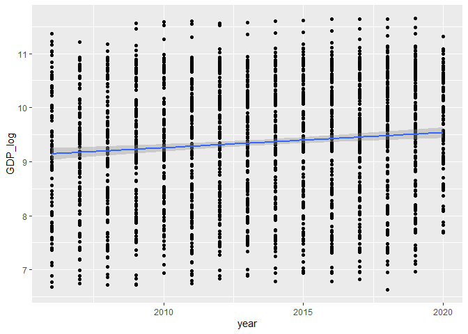
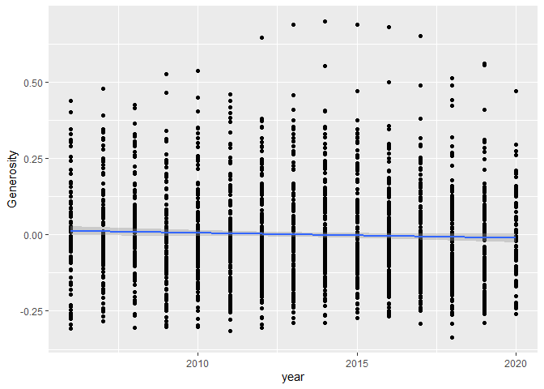

World Happiness Index
================

``` r
library(tidyverse) # Modern data science library 
```

    ## -- Attaching packages --------------------------------------- tidyverse 1.3.1 --

    ## v ggplot2 3.3.5     v purrr   0.3.4
    ## v tibble  3.1.3     v dplyr   1.0.7
    ## v tidyr   1.1.3     v stringr 1.4.0
    ## v readr   2.0.0     v forcats 0.5.1

    ## -- Conflicts ------------------------------------------ tidyverse_conflicts() --
    ## x dplyr::filter() masks stats::filter()
    ## x dplyr::lag()    masks stats::lag()

``` r
library(plm)       # Panel data analysis library
```

    ## 
    ## Attaching package: 'plm'

    ## The following objects are masked from 'package:dplyr':
    ## 
    ##     between, lag, lead

``` r
library(car)       # Companion to applied regression 
```

    ## Carregando pacotes exigidos: carData

    ## 
    ## Attaching package: 'car'

    ## The following object is masked from 'package:dplyr':
    ## 
    ##     recode

    ## The following object is masked from 'package:purrr':
    ## 
    ##     some

``` r
library(ggplot2)   # Various programing tools for plotting data
library(lmtest)    # For hetoroskedasticity analysis
```

    ## Carregando pacotes exigidos: zoo

    ## 
    ## Attaching package: 'zoo'

    ## The following objects are masked from 'package:base':
    ## 
    ##     as.Date, as.Date.numeric

``` r
library(Hmisc)     # For correlation matrix
```

    ## Carregando pacotes exigidos: lattice

    ## Carregando pacotes exigidos: survival

    ## Carregando pacotes exigidos: Formula

    ## 
    ## Attaching package: 'Hmisc'

    ## The following objects are masked from 'package:dplyr':
    ## 
    ##     src, summarize

    ## The following objects are masked from 'package:base':
    ## 
    ##     format.pval, units

``` r
library(reshape2)  # For reshapping data
```

    ## 
    ## Attaching package: 'reshape2'

    ## The following object is masked from 'package:tidyr':
    ## 
    ##     smiths

``` r
library(stargazer) #Table producer
```

    ## 
    ## Please cite as:

    ##  Hlavac, Marek (2018). stargazer: Well-Formatted Regression and Summary Statistics Tables.

    ##  R package version 5.2.2. https://CRAN.R-project.org/package=stargazer

## Data preparation

``` r
whi <- read.csv("world-happiness-report.csv")

#Rename variable columns

whi <- whi %>% 
  rename(country = ï..Country.name,
          GDP_log = Log.GDP.per.capita,
          WHI = Life.Ladder, 
          Freedom = Freedom.to.make.life.choices, 
          Life_exp = Healthy.life.expectancy.at.birth, 
          Corruption = Perceptions.of.corruption)
#Sample countries per Year
sam <- whi %>%                    # take the data.frame
  filter(!is.na(whi)) %>%    # Using "sam", filter out all rows with NAs in aa 
  group_by(year) %>%          # Then, with the filtered data, group it by "year"
  summarise(sample = n_distinct(country))   # Now summarise with unique elements 
#Check table 
sam
```

    ## # A tibble: 16 x 2
    ##     year sample
    ##    <int>  <int>
    ##  1  2005     27
    ##  2  2006     89
    ##  3  2007    102
    ##  4  2008    110
    ##  5  2009    114
    ##  6  2010    124
    ##  7  2011    146
    ##  8  2012    142
    ##  9  2013    137
    ## 10  2014    145
    ## 11  2015    143
    ## 12  2016    142
    ## 13  2017    147
    ## 14  2018    142
    ## 15  2019    144
    ## 16  2020     95

``` r
#Delete 2005, only 27 countries were sampled (results are robust to the inclusion of this year though). 
whi = whi[with(whi, year > 2005), ]
```

### Numeric variables

``` r
# select only numeric variables 
num_var<-whi %>% 
  dplyr::select(where(is.numeric))
```

### Median values by groups

``` r
# add median values for GDP_log and Generosity
med_whi<- whi %>% group_by(country) %>%
  mutate(med_freedom = median(GDP_log), 
         med_corrupt = median(Generosity), 
         med_cor_ctr = median(Life_exp),
         med_cor_ctr = median(Corruption))
med_whi
```

## EDA

### Correlation matrix

Figure below depicts the correlation matrix. Positive correlation
coefficients are highlighted in red colors, negative correlation
coefficients are in the blue color palette. Most variables are highly
correlated in this dataset. Thus, a parsimonious model is advisable.
Preffered variables are GDP\_log and Generosity, which are mostly
uncorrelated.

``` r
#calculate correlation matrix
result <- Hmisc::rcorr(as.matrix((num_var)))
cormat <- round(cor(num_var, use = "pairwise.complete.obs"),2)
#reshape the data 
melted_cormat <- melt(cormat)
#check melted data
head(melted_cormat)
```

    ##             Var1 Var2 value
    ## 1           year year  1.00
    ## 2            WHI year  0.06
    ## 3        GDP_log year  0.10
    ## 4 Social.support year  0.01
    ## 5       Life_exp year  0.18
    ## 6        Freedom year  0.25

``` r
#Plot Heatmap
ggplot(data = melted_cormat, aes(x=Var1, y=Var2, fill=value)) +
  geom_tile(color = "white")+
  scale_fill_gradient2(low = "blue", high = "red", mid = "white", 
                       midpoint = 0, limit = c(-1,1), space = "Lab", 
                       name="Pearson\nCorrelation") +
  theme_minimal()+ 
  theme(axis.text.x = element_text(angle = 90, vjust = 1, 
                                   size = 12, hjust = 1))+
  coord_fixed()
```

<!-- -->

### WHI, Generosity and GDP

Some countries have missing values for the variables chosen for our
model. Thus, we’ll deleted those from our data set.

``` r
#Check for missing values
sum(is.na(whi$WHI)) #0 missing values
```

    ## [1] 0

``` r
sum(is.na(whi$GDP_log)) # 36 missing values
```

    ## [1] 36

``` r
sum(is.na(whi$Generosity)) # 63 missing values
```

    ## [1] 63

``` r
#delete missing values
whi <- whi[complete.cases(whi$Generosity), ]
#check procedure
sum(is.na(whi$GDP_log)) # 0 missing values 
```

    ## [1] 0

In the graph below we see the histogram of the world happines index
(WHI). The median value of this index is 5.373

``` r
#Histogram WHI for all countries
ggplot(whi)+
  geom_histogram(aes(WHI), fill = "#B1E693", col = "#4A403A")+
  labs(x = "Happiness Index", y = "Number of countries", 
       title = "Histogram: Happiness Index for all Countries (2006-2020)")
```

    ## `stat_bin()` using `bins = 30`. Pick better value with `binwidth`.

<!-- -->

A fixed-effects model is likely needed to account for time-invariant
characteristics per country, such as colonization, history or rule of
law which might affect unobserved variables and violate linear
regression model assumptions.

### Graphs - correlation between variables

``` r
#Graph relationship between WHI, Generosity and GDP
#overall
ggplot(whi, aes(x=Generosity, y = WHI))+
  geom_point() +
  geom_smooth(method=lm)
```

    ## `geom_smooth()` using formula 'y ~ x'

<!-- -->

``` r
#per country group
ggplot(whi, aes(x=Generosity, y = WHI, color=country))+
  geom_point() +
  theme(legend.position="none")
```

<!-- -->

``` r
#overall
ggplot(whi, aes(x=GDP_log, y = WHI))+
  geom_point() +
  geom_smooth(method=lm) #clustered values
```

    ## `geom_smooth()` using formula 'y ~ x'

<!-- -->

``` r
#WHI by GDP_log per country color group
ggplot(whi, aes(x=GDP_log, y = WHI, color=country))+
  geom_point() + 
  theme(legend.position="none") #Highly heterogeneous groups
```

<!-- -->

\#Graphs - Effects over time

``` r
ggplot(whi, aes(x=year, y = WHI))+
  geom_point() +
  geom_smooth(method=lm)
```

    ## `geom_smooth()` using formula 'y ~ x'

<!-- -->

``` r
ggplot(whi, aes(x=year, y = GDP_log))+
  geom_point() +
  geom_smooth(method=lm)
```

    ## `geom_smooth()` using formula 'y ~ x'

<!-- -->

``` r
ggplot(whi, aes(x=year, y = Generosity))+
  geom_point() +
  geom_smooth(method=lm)
```

    ## `geom_smooth()` using formula 'y ~ x'

<!-- -->

``` r
# small effects over time for sampled countrie on average
```

\#OLS and Fixed Effects Model Analysis

``` r
ols <-lm(WHI ~ GDP_log + Generosity, data = whi)
summary(ols)
```

    ## 
    ## Call:
    ## lm(formula = WHI ~ GDP_log + Generosity, data = whi)
    ## 
    ## Residuals:
    ##      Min       1Q   Median       3Q      Max 
    ## -2.33283 -0.44683  0.01586  0.47762  1.94684 
    ## 
    ## Coefficients:
    ##             Estimate Std. Error t value Pr(>|t|)    
    ## (Intercept)  -1.6870     0.1234  -13.67   <2e-16 ***
    ## GDP_log       0.7638     0.0131   58.30   <2e-16 ***
    ## Generosity    1.3121     0.0931   14.09   <2e-16 ***
    ## ---
    ## Signif. codes:  0 '***' 0.001 '**' 0.01 '*' 0.05 '.' 0.1 ' ' 1
    ## 
    ## Residual standard error: 0.6507 on 1856 degrees of freedom
    ## Multiple R-squared:  0.6595, Adjusted R-squared:  0.6591 
    ## F-statistic:  1797 on 2 and 1856 DF,  p-value: < 2.2e-16

``` r
vif(ols)
```

    ##    GDP_log Generosity 
    ##   1.000004   1.000004

``` r
#VIF is 1 - very good (low multicolinearity, as expected)
```

OLS estimates show a high correlation between GDP\_log and Generosity
with both variables explaining approx. 65% of the variation in WHI.
However, this model violates OLS assumptions, since IVs error terms are
correlated in the sample - i.e. a same country will tend to have similar
values over time. Thus, fixed effects model are needed to control for
unnobserved and time-invariant characteristics of each country.

``` r
fixed <- plm(WHI ~ GDP_log + Generosity, data=whi, model="within",  index = c("country"))
summary(fixed)
```

    ## Oneway (individual) effect Within Model
    ## 
    ## Call:
    ## plm(formula = WHI ~ GDP_log + Generosity, data = whi, model = "within", 
    ##     index = c("country"))
    ## 
    ## Unbalanced Panel: n = 161, T = 1-15, N = 1859
    ## 
    ## Residuals:
    ##        Min.     1st Qu.      Median     3rd Qu.        Max. 
    ## -1.68301716 -0.20497226 -0.00056264  0.20217558  1.66453986 
    ## 
    ## Coefficients:
    ##            Estimate Std. Error t-value  Pr(>|t|)    
    ## GDP_log    1.040708   0.076299 13.6399 < 2.2e-16 ***
    ## Generosity 0.519698   0.123538  4.2068 2.726e-05 ***
    ## ---
    ## Signif. codes:  0 '***' 0.001 '**' 0.01 '*' 0.05 '.' 0.1 ' ' 1
    ## 
    ## Total Sum of Squares:    273.27
    ## Residual Sum of Squares: 244.7
    ## R-Squared:      0.10457
    ## Adj. R-Squared: 0.019041
    ## F-statistic: 99.0329 on 2 and 1696 DF, p-value: < 2.22e-16

That is shown here by comparison of F-statistic values, which diminished
considerably between the OLS and FE models. We can also check this
assumption using the following test:

\#Test for Individual and/or Time Effects

``` r
pFtest(fixed, ols)
```

    ## 
    ##  F test for individual effects
    ## 
    ## data:  WHI ~ GDP_log + Generosity
    ## F = 23.443, df1 = 160, df2 = 1696, p-value < 2.2e-16
    ## alternative hypothesis: significant effects

Since the p-value is &lt; 0.05 we can conclude that the fixed effects
model is a better choice

\#Correcting for heteroskedasticity of residuals

``` r
coeftest(fixed, vcov = vcovHC, type = "HC1") # Heteroskedasticity consistent 
```

    ## 
    ## t test of coefficients:
    ## 
    ##            Estimate Std. Error t value  Pr(>|t|)    
    ## GDP_log     1.04071    0.17052  6.1031 1.286e-09 ***
    ## Generosity  0.51970    0.20634  2.5186   0.01187 *  
    ## ---
    ## Signif. codes:  0 '***' 0.001 '**' 0.01 '*' 0.05 '.' 0.1 ' ' 1

As we can see from the robust error estimates above, p-values grow for
our model coefficients, but are still bellow 5% threshold. Moreover, is
our data consistent with random effects model?

\#Checking for random effects

``` r
random <- plm(WHI ~ GDP_log + Generosity, data=whi, model="random",  index = c("country"))
summary(random)
```

    ## Oneway (individual) effect Random Effect Model 
    ##    (Swamy-Arora's transformation)
    ## 
    ## Call:
    ## plm(formula = WHI ~ GDP_log + Generosity, data = whi, model = "random", 
    ##     index = c("country"))
    ## 
    ## Unbalanced Panel: n = 161, T = 1-15, N = 1859
    ## 
    ## Effects:
    ##                  var std.dev share
    ## idiosyncratic 0.1443  0.3798 0.341
    ## individual    0.2792  0.5284 0.659
    ## theta:
    ##    Min. 1st Qu.  Median    Mean 3rd Qu.    Max. 
    ##  0.4163  0.7968  0.8045  0.7973  0.8113  0.8175 
    ## 
    ## Residuals:
    ##     Min.  1st Qu.   Median     Mean  3rd Qu.     Max. 
    ## -1.63586 -0.23661  0.01865  0.00062  0.23474  1.62157 
    ## 
    ## Coefficients:
    ##              Estimate Std. Error z-value  Pr(>|z|)    
    ## (Intercept) -2.087017   0.310203 -6.7279 1.721e-11 ***
    ## GDP_log      0.805611   0.033017 24.4001 < 2.2e-16 ***
    ## Generosity   0.636107   0.114305  5.5650 2.621e-08 ***
    ## ---
    ## Signif. codes:  0 '***' 0.001 '**' 0.01 '*' 0.05 '.' 0.1 ' ' 1
    ## 
    ## Total Sum of Squares:    409.12
    ## Residual Sum of Squares: 270.48
    ## R-Squared:      0.33891
    ## Adj. R-Squared: 0.3382
    ## Chisq: 621.271 on 2 DF, p-value: < 2.22e-16

``` r
#Model comparison (FIXED vs RANDOM)
phtest(fixed, random)
```

    ## 
    ##  Hausman Test
    ## 
    ## data:  WHI ~ GDP_log + Generosity
    ## chisq = 20.562, df = 2, p-value = 3.428e-05
    ## alternative hypothesis: one model is inconsistent

Since p-value is significant (i.e. &lt;0.05) we can conclude that the
fixed effects model offers more appropriate estimates than the random
effects model.

\#Restrict the panel data to years above 2012 and run the models

``` r
whi_2012 = whi[with(whi, year >= 2012), ]
```

\#Models Stargazer

``` r
m1 <- lm(WHI ~ Generosity, data = whi)
m2 <- lm(WHI ~ Generosity + GDP_log, data = whi)
m3 <- plm(WHI ~ Generosity + GDP_log + country, data = whi)
m4 <- plm(WHI ~ Generosity + GDP_log + country + year,
                       index = c("country"),
                       model = "within",
                       effect = "twoways", 
                       data = whi)
m5 <- plm(WHI ~ Generosity + GDP_log + country + year,
          index = c("country"),
          model = "within",
          effect = "twoways", 
          data = whi_2012)
rob_se <- list(sqrt(diag(vcovHC(m1, type = "HC1"))),
               sqrt(diag(vcovHC(m2, type = "HC1"))),
               sqrt(diag(vcovHC(m3, type = "HC1"))),
               sqrt(diag(vcovHC(m4, type = "HC1"))),
               sqrt(diag(vcovHC(m4, type = "HC1"))))
# generate the table
stargazer(m1,m2,m3,m4,m5, 
          digits = 3,
          header = FALSE,
          type = "html", 
          se = rob_se,
          title = "Linear Panel Regression Models of Happiness Index",
          model.numbers = FALSE,
          column.labels = c("(1)", "(2)", "(3)", "(4)", "(5)"))
```

    ## 
    ## <table style="text-align:center"><caption><strong>Linear Panel Regression Models of Happiness Index</strong></caption>
    ## <tr><td colspan="6" style="border-bottom: 1px solid black"></td></tr><tr><td style="text-align:left"></td><td colspan="5"><em>Dependent variable:</em></td></tr>
    ## <tr><td></td><td colspan="5" style="border-bottom: 1px solid black"></td></tr>
    ## <tr><td style="text-align:left"></td><td colspan="5">WHI</td></tr>
    ## <tr><td style="text-align:left"></td><td colspan="2"><em>OLS</em></td><td colspan="3"><em>panel</em></td></tr>
    ## <tr><td style="text-align:left"></td><td colspan="2"><em></em></td><td colspan="3"><em>linear</em></td></tr>
    ## <tr><td style="text-align:left"></td><td>(1)</td><td>(2)</td><td>(3)</td><td>(4)</td><td>(5)</td></tr>
    ## <tr><td colspan="6" style="border-bottom: 1px solid black"></td></tr><tr><td style="text-align:left">Generosity</td><td>1.302<sup>***</sup></td><td>1.312<sup>***</sup></td><td>0.520<sup>**</sup></td><td>0.505<sup>**</sup></td><td>0.572<sup>***</sup></td></tr>
    ## <tr><td style="text-align:left"></td><td>(0.167)</td><td>(0.099)</td><td>(0.206)</td><td>(0.208)</td><td>(0.208)</td></tr>
    ## <tr><td style="text-align:left"></td><td></td><td></td><td></td><td></td><td></td></tr>
    ## <tr><td style="text-align:left">GDP_log</td><td></td><td>0.764<sup>***</sup></td><td>1.041<sup>***</sup></td><td>1.222<sup>***</sup></td><td>1.485<sup>***</sup></td></tr>
    ## <tr><td style="text-align:left"></td><td></td><td>(0.012)</td><td>(0.171)</td><td>(0.220)</td><td>(0.220)</td></tr>
    ## <tr><td style="text-align:left"></td><td></td><td></td><td></td><td></td><td></td></tr>
    ## <tr><td style="text-align:left">year</td><td></td><td></td><td></td><td>-0.018</td><td>0.023</td></tr>
    ## <tr><td style="text-align:left"></td><td></td><td></td><td></td><td>(0.020)</td><td>(0.020)</td></tr>
    ## <tr><td style="text-align:left"></td><td></td><td></td><td></td><td></td><td></td></tr>
    ## <tr><td style="text-align:left">Constant</td><td>5.452<sup>***</sup></td><td>-1.687<sup>***</sup></td><td></td><td></td><td></td></tr>
    ## <tr><td style="text-align:left"></td><td>(0.025)</td><td>(0.114)</td><td></td><td></td><td></td></tr>
    ## <tr><td style="text-align:left"></td><td></td><td></td><td></td><td></td><td></td></tr>
    ## <tr><td colspan="6" style="border-bottom: 1px solid black"></td></tr><tr><td style="text-align:left">Observations</td><td>1,859</td><td>1,859</td><td>1,859</td><td>1,859</td><td>1,187</td></tr>
    ## <tr><td style="text-align:left">R<sup>2</sup></td><td>0.036</td><td>0.659</td><td>0.105</td><td>0.087</td><td>0.086</td></tr>
    ## <tr><td style="text-align:left">Adjusted R<sup>2</sup></td><td>0.035</td><td>0.659</td><td>0.019</td><td>-0.010</td><td>-0.064</td></tr>
    ## <tr><td style="text-align:left">Residual Std. Error</td><td>1.095 (df = 1857)</td><td>0.651 (df = 1856)</td><td></td><td></td><td></td></tr>
    ## <tr><td style="text-align:left">F Statistic</td><td>69.110<sup>***</sup> (df = 1; 1857)</td><td>1,797.266<sup>***</sup> (df = 2; 1856)</td><td>99.033<sup>***</sup> (df = 2; 1696)</td><td>53.086<sup>***</sup> (df = 3; 1681)</td><td>32.078<sup>***</sup> (df = 3; 1018)</td></tr>
    ## <tr><td colspan="6" style="border-bottom: 1px solid black"></td></tr><tr><td style="text-align:left"><em>Note:</em></td><td colspan="5" style="text-align:right"><sup>*</sup>p<0.1; <sup>**</sup>p<0.05; <sup>***</sup>p<0.01</td></tr>
    ## </table>

\#Dickey-Fuller test to check for stochastic trends

``` r
Panel.set <- plm.data(whi, index = c("country", "year"))
```

    ## Warning: use of 'plm.data' is discouraged, better use 'pdata.frame' instead

``` r
library(tseries)
```

    ## Registered S3 method overwritten by 'quantmod':
    ##   method            from
    ##   as.zoo.data.frame zoo

``` r
adf.test(Panel.set$WHI, k=2)
```

    ## Warning in adf.test(Panel.set$WHI, k = 2): p-value smaller than printed p-value

    ## 
    ##  Augmented Dickey-Fuller Test
    ## 
    ## data:  Panel.set$WHI
    ## Dickey-Fuller = -10.161, Lag order = 2, p-value = 0.01
    ## alternative hypothesis: stationary

No unit-roots are present as p &lt; 0.05. This means that the model does
not suffer from sazonality issues, and that the fixed effects model can
be considered reliable.
